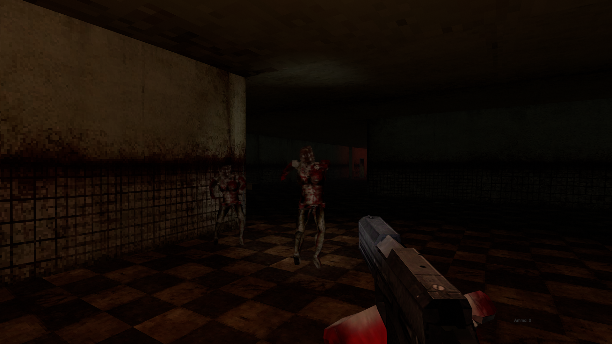

# HEAL: A PSX-Inspired Survival Horror Game

<!-- BADGES/SHIELDS -->


**HEAL** is a complete, first-person survival horror game developed in Unity, inspired by the atmospheric tension and resource management of PlayStation 1 classics like *Silent Hill* and *Resident Evil*. This project showcases an end-to-end development cycle, from 3D modeling and animation to complex AI programming and UI design.

The core aim was to create an unsettling experience through a combination of retro aesthetics, strategic gameplay, and environmental storytelling, demonstrating that technical implementation can be used to evoke powerful emotional responses.

_This project was submitted as a final year BSc (Hons) Computer Science project at Royal Holloway, University of London._

---

## Gameplay & Features

The player must navigate a dark, oppressive environment while managing limited resources, solving environmental puzzles, and evading or confronting unsettling enemies. The game emphasizes strategic decision-making and careful exploration.

* **First-Person Survival:** A tense, immersive experience focused on vulnerability and atmosphere.
* **Inventory Management:** A classic grid-based inventory system for managing scarce resources like ammunition, healing items, and key items.
* **Intelligent Enemy AI:** NPCs built with a Finite State Machine (FSM) and Unity's NavMesh pursue the player, react to their presence, and create dynamic, unscripted encounters.
* **Custom 3D Assets:** All key character models, environments, and items were modeled and textured in Blender to achieve a specific low-poly, retro PSX aesthetic.
* **Full UI Suite:** Includes a dynamic main menu, pause/options screen, and an in-game inventory and health status system.
* **Interactable World:** Players can pick up, use, and examine items to solve puzzles and progress through the story.

---

## Technical Demonstration

Here are some snapshots of the game's systems and aesthetics in action.

| Main Menu & UI                                       | In-Game Atmosphere with Flashlight                 |
| ---------------------------------------------------- | -------------------------------------------------- |
|  |  |

| Inventory System                                     | Enemy Encounter                                    |
| ---------------------------------------------------- | -------------------------------------------------- |
|  |  |

---

## Technology Stack & Core Concepts

This project was built using a combination of industry-standard tools and software engineering principles.

| Component                 | Technology & Concepts                                                                                      |
| ------------------------- | ---------------------------------------------------------------------------------------------------------- |
| **Game Engine** | Unity 2022, C#                                                                                             |
| **AI & Pathfinding** | Finite State Machines (FSM), Unity AI Navigation (NavMesh), A* Pathfinding                                 |
| **3D Asset Creation** | Blender (Modeling, Rigging, Animation), Krita (Texturing)                                                  |
| **Gameplay Mechanics** | Raycasting for Interactions, Singleton & State Design Patterns, Character Controllers                      |
| **Software Engineering** | Agile Methodology, Version Control (Git), UML Diagrams, Unit Testing, Playtesting & Feedback Integration |

---

## Systems & Project Management Insight

While HEAL is a creative project, its development rigorously followed software engineering and IT management principles that are directly applicable to a corporate environment like Prada.

* **End-to-End Project Lifecycle Management:** The project was managed from initial concept to final delivery using an **Agile methodology**. Tasks were broken down into sprints, with continuous evaluation and adaptation, demonstrating the ability to handle a complex project with evolving requirements.
* **Systematic Troubleshooting & Debugging:** A significant portion of development involved diagnosing and fixing complex issues, from AI pathfinding bugs on the NavMesh to hardware compatibility issues with physics components. This required a methodical approach to problem-solving identical to that used in IT support.
* **User Support & Documentation:** The project included creating a **User Manual** and conducting structured **playtesting sessions**. Feedback from users was systematically collected and used to improve UI intuitiveness and fix bugs, demonstrating a focus on the end-user experience.
* **Version Control & Asset Management:** The entire project was managed using **Git**, with a structured branching strategy to ensure code stability. All third-party assets were ethically sourced and properly credited, showing an understanding of licensing and professional conduct.

This experience in building, debugging, and documenting a complete software product provides a strong foundation for supporting and managing the critical IT systems that power a global luxury brand.

---

## Play right now!

Play for free at: https://danteveil.github.io/Heal-Video-Game/


---

## Setup & Installation

To run this project, you will need Unity Hub and Unity Editor Version 2022.3.6f1.

1.  **Clone the repository:**
    ```bash
    git clone [https://github.com/DanteVeil/Heal-Video-Game.git](https://github.com/DanteVeil/Heal-Video-Game.git)
    ```
2.  **Open the project in Unity Hub:**
    * Open Unity Hub.
    * Click "Open" -> "Add project from disk".
    * Navigate to the cloned `Heal-Video-Game` folder and select it.
3.  **Run the Game:**
    * Once the project is open in the Unity Editor, locate the `MainMenu` scene in the `Assets/Scenes` folder.
    * Open the `MainMenu` scene and press the Play button at the top of the editor.


